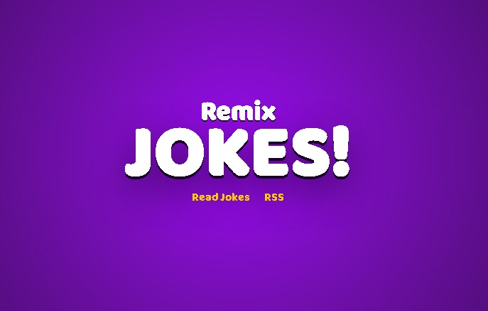

# Remix Run!: Hooks, State, Prisma, SQLite Docker

Esta es una solucion al tutorial largo de la documentacion de remix run!: [*"Remix run! Doc"*](https://remix.run/docs/en/main/tutorials/jokes).

## Table of contents

- [Overview](#overview)
  - [Screenshot](#screenshot)
  - [Links](#links)
- [My process](#my-process)
  - [Built with](#built-with)
  - [What I learned](#what-i-learned)
- [Author](#author)

## Overview

### Screenshot

### Links

- Solution URL: [Solution](https://github.com/samuelpklm/remix-chistes)
- Live Site URL: [Live Site](https://remix-chistes.fly.dev/)

## My process

### Built with

- Semantic HTML5 markup
- Mobile-first workflow
- [React](https://reactjs.org/) - JS library
- React + TypeScript
- Remix run
- SQLite
- Prisma
- Zod

### What I learned

I learned to use remix run with typescript, client server management. and implementation of a SQLite database.

## Author

- Website - [Samuel](https://samuelpklm.github.io/samuel.github.com/)
- Frontend Mentor - [@samuelpklm](https://www.frontendmentor.io/profile/samuelpklm)
- Correo - samuelr76@gmail.com
